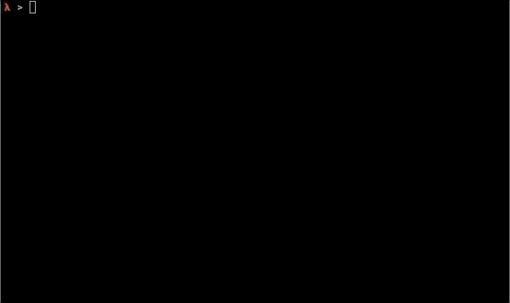

# *Crabs*
>A simple terminal game written in Rust. 

This is a pretty minimal game in which you have to guide a consortium of crabs to safety. Gameplay is heavily inspired by Jagex's [Flea Circus](https://jagex.fandom.com/wiki/Flea_Circus) and DMA Design's [Lemmings](https://en.wikipedia.org/wiki/Lemmings_(video_game)). I wrote this as a prototype for a full graphical version, which I hope to one day write using [Amethyst](https://github.com/amethyst/amethyst).

[](https://crates.io/crates/crabs)

**Table of contents**
1. [Installation](#installation)
2. [Usage](#usage)
3. [Customisation](#customisation)
4. [To Do](#to-do)
5. [License](#license)

<a name="installation"></a>
## Installation
Requires an installation of [Rust](https://www.rust-lang.org/tools/install). Recommended build profile is release:
    
    $ curl https://sh.rustup.rs -sSf | sh                  # install Rust
    $ git clone https://github.com/lewis-weinberger/crabs  # clone repository
    $ cd crabs                                             # cd into source directory
    $ cargo run --release                                  # compile and run

The latest version can also be installed directly from crates.io:

    $ cargo install crabs

By default this downloads and builds the **crabs** crate, installing the binary in `$HOME/.cargo/bin/`. Otherwise you can download pre-compiled binaries from the Releases section.

<a name="usage"></a>
## Usage

The following GIF shows some gameplay:



A short explanation of the game can be found by passing the `--help` switch:
```
$ crabs --help
crabs --help
------------
Guide the crabs to safety:
	. crab
	X safety
Use the arrow keys to move the cursor:
	+ cursor
Insert scenery by typing the appropriate key:
	# block
	/ forward ramp
	\ backward ramp
	@ trampoline
Type q to quit.

Use a custom map saved in RON format:
	$ crabs custom_level.ron
```

<a name="customisation"></a>
## Customisation

There are a number of default levels built into the game, but it is also possible to play your own! In order to do this you'll need to create a map and add some crabs. The map can be loaded from a string which contains a rectangular block of text. The crabs need to have positions and velocities* specified. To use your custom level you must create a RON file, formatted as follows:

```
// custom_level.ron
(
    positions: [[1,1], [1, 3]],
    velocities: [[1,1], [1, -1]],
    layout: "   \n   \n###",
)
```

You can then load this level by passing the RON file path as the first argument to `crabs`. If you don't want to type out a string manually to represent your map, you can use the provided `make-map` program. This uses the same interface as the game, and allows you to place scenery to make a map. 

```
$ make-map --help
make-map --help
------------
Design your own map!
Use the arrow keys to move the cursor:
	+ cursor
Insert scenery by typing the appropriate key:
	X safety
	# block
	/ forward ramp
	\ backward ramp
	@ trampoline
Type q to quit. You will be prompted for a filename to save your new map.
```

An example level is provided in the [examples](/examples) directory.

*Note that the y-coordinate starts at 0 at the top of the terminal, so positive y-velocity corresponds to a downward velocity on the terminal!

<a name="to-do"></a>
## To Do
1. Full graphical version?
2. WASM?

As this was intended to be a prototype, I don't have plans to add more features to this version, although it could definitely be expanded to include:

1. More scenery types, such as something that kills the crabs.
2. More/better levels.
3. More customisation, including different colours and characters used for display.

Contributions are welcome! Please submit an issue or pull request.

<a name="license"></a>
## License

[MIT License](LICENSE)